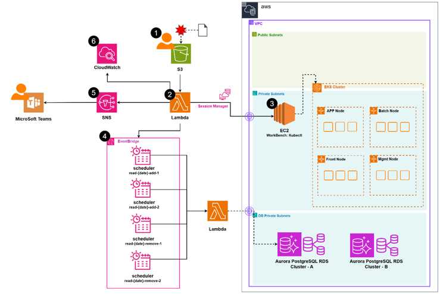

# S3-Driven Scheduled Autoscaling for EKS Pods and Aurora Read Replicas

This solution automates **proactive infrastructure scaling** based on scheduled entries defined in a `.csv` file uploaded to Amazon S3. The system supports two types of scheduled actions:

1. **EKS pod scaling** via crontab on a Workbench EC2 instance.
2. **Aurora PostgreSQL read replica scaling** via EventBridge Scheduler triggering a Lambda function.


## 🧩 Architecture Overview

 


## 📂 Project Structure
```
.
├── src/
│ ├── scale_handler.py # Lambda handler triggered by schedule
│ ├── eks_scaler.py # Functions to scale EKS node groups
│ ├── rds_scaler.py # Functions to modify RDS instances
│ └── config.py # Configuration for scaling targets and policies
├── events/
│ └── scheduled_event.json # Example EventBridge Scheduler event payload
├── docs/
│ ├── architecture.png # Architecture diagram
│ └── 
├── requirements.txt # Python dependencies
└── README.md # Project documentation

```

## ⚙️ Requirements

- **S3 Bucket**
  - Trigger: `s3:ObjectCreated:*` event connected to a Lambda function

- **Lambda Execution Role** must include permissions to:
  - Read objects from S3
  - SSH or use SSM to access EC2 for crontab updates
  - Create EventBridge Scheduler rules
  - Modify RDS (e.g., `ModifyDBCluster`, `CreateDBInstance`)

- **Workbench EC2 Instance** must:
  - Be reachable via SSH from Lambda
  - Have `kubectl` installed and configured for EKS access
  - Have the `scale_eks_script.sh` deployed and executable


## 🛠️ Workflow

### 1. Upload Schedule

Upload a `.csv` file to the configured S3 bucket

### 2. Lambda Triggered

When the `.csv` file is uploaded to S3, a Lambda function is automatically triggered.

The Lambda function performs the following actions:

#### For EKS entries:
- Connects to the EC2 instance (workbench or jumpbox) via SSH or SSM
- Adds a `crontab` entry that schedules the execution of 
  `eks_autoscale.sh` at the specified time

#### For RDS entries:
- Creates an **EventBridge Scheduler** rule
- The rule is configured to invoke the `managing-aurora-reader-lmb.py` Lambda function at the defined time


### 3. EKS Pod Scaling (via EC2 crontab)

At the scheduled time, the `pod_autoscale.sh`script is executed on the EC2 instance:


## ⚙️ Prerequisites


## 🛠️ Deployment Steps


## 🧪 Sample Scheduler Event Payload


## 📌 Notes 


## 🧪 Sample EventBridge Lambda Payload
